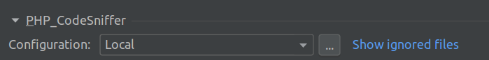
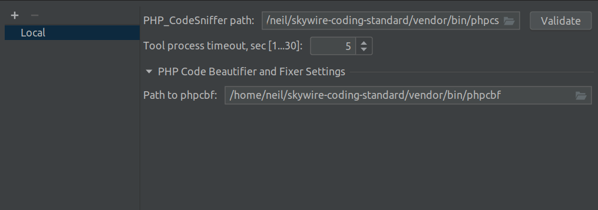
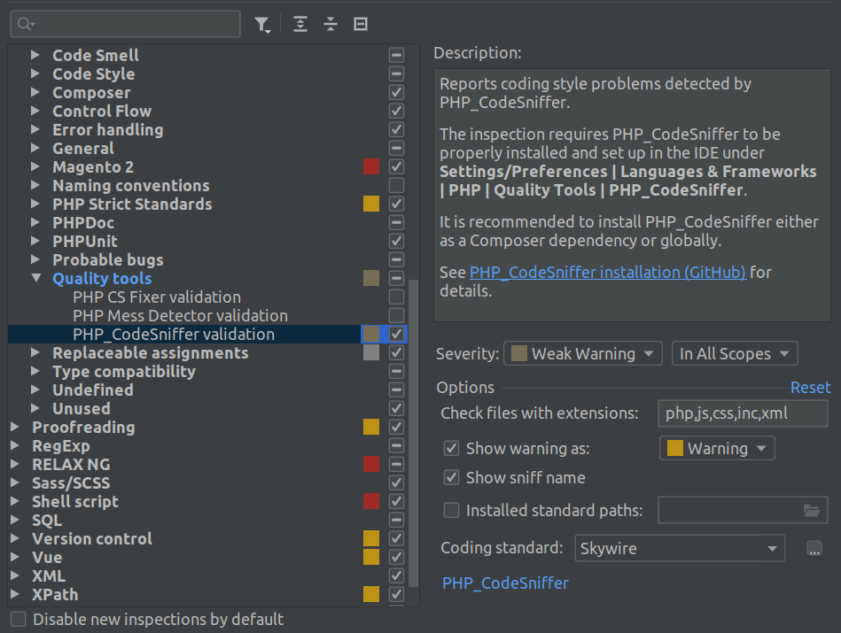

# Skywire Magento 2 coding standard

Custom coding standard extending `magento/magento-coding-standard`

## Installation to a project

`composer require skywire/skywire-coding-standard`

## Global Installation for PHPStorm

### Install standard

```
cd ~/
git clone git@github.com:Skywire/skywire-coding-standard.git
cd skywire-coding-standard
composer install
```

### Configure PHPStorm

#### Configure tool paths

Open `Quality Tools settings`

[File | Settings | Languages & Frameworks | PHP | Quality Tools](jetbrains://PhpStorm/settings?name=Languages+%26+Frameworks--PHP--Quality+Tools)

Open `PHP_CodeSniffer` tab and click the `...` button next to the first dropdown



Configure your PhpCS and phpcbf binary paths to point to ~/skywire-coding-standard/vendor/bin



#### Configure inspections

Open inspections settings

[File | Settings | Editor | Inspections](jetbrains://PhpStorm/settings?name=Editor--Inspections)

Find Quality tools -> PHPCodeSniffer_validation and check the checkbox to ensure it's enabled

Under options add `,xml,phtml`  to the file extensions to check and set the coding standard to `Skywire`



## Running from CLI

To run against specific files or directories with the same configuration as PHPStorm use

`~/skywire-coding-standard/vendor/bin/phpcs --extensions=php,js,css,inc,xml,phtml --standard=Skywire [path-to-files-to-sniff]`